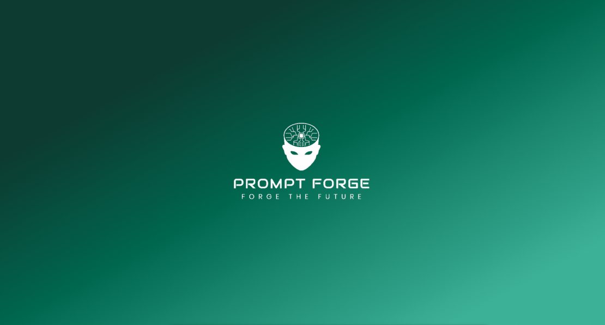

  

# 5iveOps - Prompt Forge

Prompt Forge is a full-featured web-based platform designed to help individuals and organizations craft, test, and evaluate high-performing prompts for AI systems. It empowers users to explore prompt effectiveness, compare results across different models, and collaborate in a structured and ethical environment.

---

## 🔗 Project Links

- 🔖 [Functional Requirements (SRS) Document](https://your-link-to-srs.com)
- 📋 [GitHub Project Board](https://github.com/YourOrg/prompt-forge/projects)
- 🗂️ [Demo 1 Instructions](./docs/Capstone_Demo1_Instructions.pdf)

---

## 👨‍💻 Team Members

| Name                | Student Number | LinkedIn                                      | GitHub                                |
|---------------------|----------------|-----------------------------------------------|----------------------------------------|
| Katlego Mositi      | 22658395       | [LinkedIn](http://www.linkedin.com/in/katlegomositi)     | [GitHub](https://github.com/katlegomositi)     |
| Paballo Diyase      | 23528142       | [LinkedIn](https://www.linkedin.com/in/paballo-diyase-486895318/) | [GitHub](https://github.com/mainmee)            |
| Boitumelo Mtsatse   | 23684365       | [LinkedIn](https://www.linkedin.com/in/boitumelo-mtsatse-44832a33a/) | [GitHub](https://github.com/BoitumeloMtsatse)   |
| Navendran Naidoo    | 21512494       | [LinkedIn](https://www.linkedin.com/in/navendran-naidoo-0bb732221) | [GitHub](https://github.com/naven1309)          |
| Rethabile Bore      | 23772141       | [LinkedIn](https://www.linkedin.com/in/rethabilebore)     | [GitHub](https://github.com/riri-bygit)         |

  

---

## 🧪 Demo 1 Goals (Due: 28 May 2025)

The first demo will showcase light implementations of at least three use cases.

### ✅ Planned Demo 1 Features

- 🔑 **Alternative Authentication Systems**
- 👤 **User Profile Setup**
- 🛍️ **Prompt Store (Phase 1)**
- 🔍 **Prompt Filtering**
- 📊 **Prompt Details Page**
- 🤖 **LLM Integration**

---

## 🧱 Tech Stack

| Layer         | Technology                         |
|---------------|-------------------------------------|
| Frontend      | React with Tailwind CSS            |
| Backend       | Spring Boot                        |
| Database      | PostgreSQL                         |
| LLMs          | Hugging Face (Sentiment Analysis)  |
| Auth          | Mock Auth / Alternative Auth       |
| Versioning    | Git + GitFlow                      |
| Deployment    | AWS Free Tier / Local Dev          |
| Testing       | Jest, JUnit (Planned)              |

---

## 🌳 Branching Strategy (GitFlow)

- `main` – Stable production code  
- `develop` – Active development branch  
- `feature/*` – New features (e.g. `feature/auth`)  
- `release/*` – Pre-demo branches  
- `hotfix/*` – Emergency fixes  

---

## ✅ Base Features

- [ ] Registration & Login (with mocks)
- [ ] Basic UI themes (Tailwind)
- [ ] Form validation

---

## 🔍 Repository Quality

| Item                    | Status     |
|-------------------------|------------|
| CI/CD Pipeline          | Pending    |
| Unit Tests (Frontend)   | Planned    |
| Unit Tests (Backend)    | Planned    |
| Code Coverage Badge     | Planned    |
| Issue Tracking          | ✅ Enabled |
| GitHub Project Board    | ✅ Linked  |

---

## ⏱️ Meeting Schedule

- 🧑‍🤝‍🧑 Internal Standups: Daily (scheduled on Google Meet)
- 💼 Industry Client Meetings: Bi-weekly via Google Meet
- 🧾 Meeting minutes logged on ClickUP under Group Discussions

---

## 📋 Demo 1 Checklist

- [ ] Requirements clarification with client ✅
- [ ] GitHub README, Project Board, and team profiles ✅
- [ ] At least 3 working low-level use cases ✅
- [ ] Unit Tests
- [ ] SRS Link uploaded
- [ ] Booked Demo Slot via Hyperperform

---

## 📬 Contact

For questions or feedback, reach us at: [5iveOps.Capstone@gmail.com](mailto:5iveOps.Capstone@gmail.com)

---

> © 2025 Team 5iveOps – COS 301 – University of Pretoria
