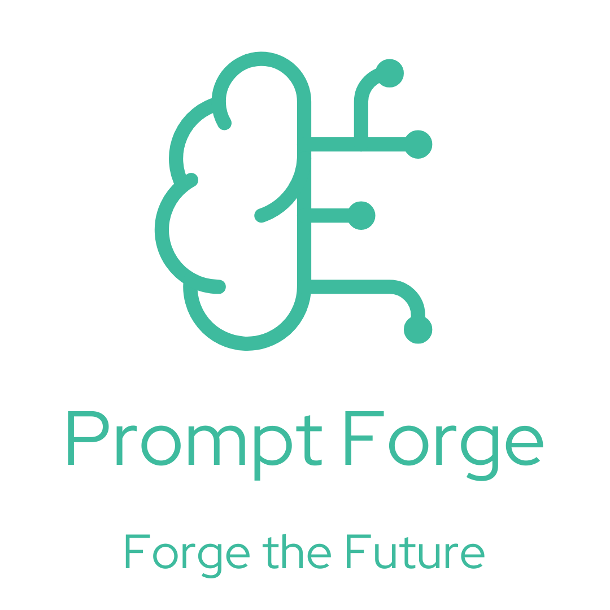
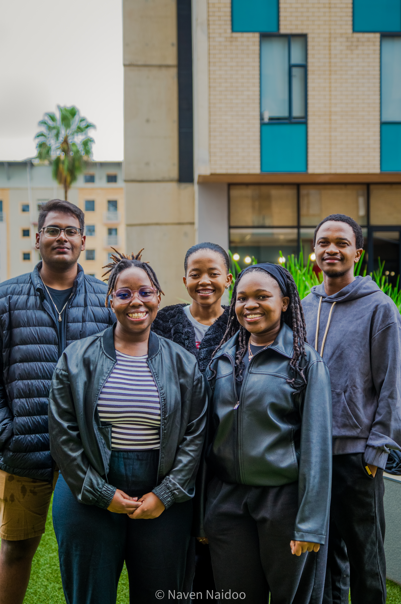
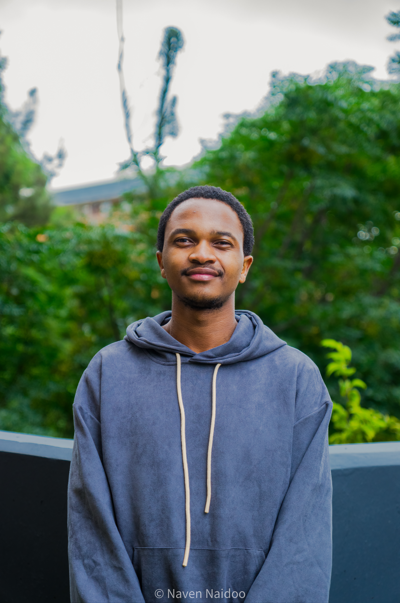
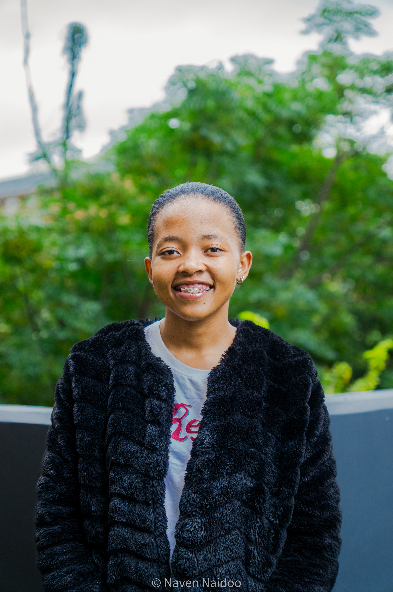

<h1 align="center">5iveOps - Prompt Forge</h1>

  

<h3 align="center">A Capstone Project for
   <a href="https://www.epiuselabs.com/">
EPI-USE Labs.     </a>
</h3>

Prompt Forge is a full-featured web-based platform designed to help individuals and organizations craft, test, and evaluate high-performing prompts for AI systems. It empowers users to explore prompt effectiveness, compare results across different models, and collaborate in a structured and ethical environment.

---

## 🏷️ Project Status

---

## 🔗 Project Links

- 🔖 [SRS Document](https://drive.google.com/file/d/1MzNRdNrnuJSb2zFWhGzk9HNghr1E9Z6h/view?usp=drive_link)
- 📋 [GitHub Project Board](https://github.com/COS301-SE-2025/Prompt-Forge/projects)

---

## 📑 Demo 1 Documentation Links

| Document                  | Link                                                    | Last Updated |
|--------------------------|--------------------------------------------------------|--------------|
| Use Case Diagram         | [View Diagram](https://drive.google.com/file/d/1eoIGPYuoWCs3tRzsBlW02MM4sN4x7rvT/view?usp=drive_link)     | May 2025     |
| SRS Document             | [View SRS](https://drive.google.com/file/d/1ojft7UjbRuU96RTMqqTKClgqYOL5ZKWm/view?usp=drive_link)                               | May 2025     |
| Functional Requirements  | [View Requirements](https://drive.google.com/file/d/1UBtGIk0gNEKziwiy4G1PO9w5LVT4bgFg/view?usp=drive_link)     | May 2025     |
| Domain Model            | [View Model](https://drive.google.com/file/d/1V0wv8kGaGNVB6bygEwAQ0wgOQsAP6vz1/view?usp=drive_link)            | May 2025     |
| Architectural Diagram   | [View Architecture](https://drive.google.com/file/d/1dEjR2zyeBPEoBtFn4JxvvIUPm-gGjR4y/view?usp=drive_link)      | May 2025     |
| Demo 1 Video  | [Watch Video](https://drive.google.com/file/d/1lekgm25uiSeLMxurxhPEMP1yBw_nFJR-/view?usp=sharing)      | May 2025     |

---

## 📑 Demo 2 Documentation Links

| Document                  | Link                                                    | Last Updated |
|--------------------------|--------------------------------------------------------|--------------|
| Use Case Diagrams         | [View Diagram](https://drive.google.com/file/d/1eoIGPYuoWCs3tRzsBlW02MM4sN4x7rvT/view?usp=drive_link)     | June 2025     |
| SRS Document             | [View SRS](https://drive.google.com/file/d/1ojft7UjbRuU96RTMqqTKClgqYOL5ZKWm/view?usp=drive_link)                               | June 2025     |
| Functional Requirements  | [View Requirements](https://drive.google.com/file/d/1UBtGIk0gNEKziwiy4G1PO9w5LVT4bgFg/view?usp=drive_link)     | June 2025     |
| Domain Model            | [View Model](https://drive.google.com/file/d/1V0wv8kGaGNVB6bygEwAQ0wgOQsAP6vz1/view?usp=drive_link)            | June 2025     |
| System Architecture   | [View Architecture](https://drive.google.com/file/d/1dEjR2zyeBPEoBtFn4JxvvIUPm-gGjR4y/view?usp=drive_link)      | June 2025     |
| Demo 2 Video  | [Watch Video](https://drive.google.com/file/d/1lekgm25uiSeLMxurxhPEMP1yBw_nFJR-/view?usp=sharing)      | June 2025     |

---

## 🧪 Demo 2 Goals (Due: 27 June 2025)

The second demo will showcase a functional, integrated system that allows users to test prompts and interact with a production-ready marketplace.

### ✅ Planned Demo 2 Features

- 🧠 **Prompt Testing Ground**
  - LLM integration
  - Real-time testing

- 🛒 **Fully Functional Prompt Marketplace**
  - Buying and selling features
  - Advanced filtering system
  - User reviews and ratings

- 🔁 **Frontend–Backend Integration**
  - Live prompt evaluation
  - Real-time data updates
  - Seamless user experience

- 📊 **Prompt Performance Metrics**
  - Usage statistics
  - Rating analytics
  - Performance comparisons

---

## 🏗️ Repository Structure & GitFlow

We use a **GitFlow** branching strategy to organize our development:

- **Main** – Production-ready code.
- **Dev** – Major development changes and integration.
- **Feature** – Temporary branches for developing new features.
- **Bugfix** – For fixing non-critical bugs.
- **Hotfix** – For addressing critical production issues that need immediate fixing.

**Pros of this approach:**
- Provides a clear separation between stable releases, ongoing development, and feature work.
- Ensures a well-structured workflow for large projects and planned releases.
- Supports parallel development of multiple features without affecting stability.
- Feature branches enable focused development efforts, reducing the risk of introducing bugs in the main codebase.

---

## 🧱 Tech Stack

| Layer         | Technology                         |  |
|---------------|-------------------------------------|-------|
| Frontend      | React with Tailwind CSS            |  |
| Backend       | Spring Boot                        |  |
| Database      | PostgreSQL                         |  |
| LLMs          | Hugging Face (Sentiment Analysis)  |  |
| Auth          | Mock Auth / Alternative Auth       |  |
| Versioning    | Git + GitFlow                      |  |
| Deployment    | AWS Free Tier / Local Dev          |  |
| Testing       | JUnit                              |  |

---

## 🌳 Branching Strategy (GitFlow)

- `main` – Stable production code  
- `dev` – Active development branch  
- `feature/*` – New features (e.g. `feature/auth`)  
- `release/*` – Pre-demo branches  
- `hotfix/*` – Emergency fixes  

---

## 🔍 Repository Quality

| Item                    | Status     |
|-------------------------|------------|
| CI/CD Pipeline          |  |
| Unit Tests (Backend)    | ✅ Completed|
| Issue Tracking          | ✅ Enabled |
| GitHub Project Board    | ✅ Linked  |
| Code Coverage           |  |
| Code Quality            |  |

---

## ⏱️ Meeting Schedule

- 🧑‍🤝‍🧑 Internal Standups: Daily (scheduled on Google Meet)
- 💼 Industry Client Meetings: Bi-weekly via Google Meet/Discord
- 🧾 Meeting minutes logged on ClickUp

---

## 📋 Demo 2 Checklist (Due: 27 June 2025)

- [X] **Core Implementation**
  - [X] 3+ New fully integrated components
  - [X] Complete backend-to-frontend integration
  - [X] Functional requirements satisfied
  - [X] Landing page implemented and live
  - [X] In-product help menu functioning

- [X] **Testing & Quality**
  - [X] Automated unit tests passing
  - [X] Integration tests complete
  - [X] CI/CD pipeline running tests
  - [X] 5 quantified quality requirements
  - [X] GitFlow structure maintained

- [X] **Documentation Updates**
  - [X] SRS Document v2
    - [X] Updated functional requirements
    - [X] New domain model
    - [X] Enhanced use case diagram
  - [X] Architecture Documentation
    - [X] System constraints
    - [X] Technology justifications

- [X] **Demo Preparation**
  - [X] Quality & architecture overview (3min)
  - [X] Feature demonstrations (5min)
  - [X] Testing walkthrough (3min)
  - [X] Q&A prep (2min)
  - [X] Speaking roles assigned
  - [X] Slides prepared

- [ ] **Final Steps**
  - [ ] Code merged to main
  - [ ] Mentor grading submitted
  - [ ] Repository cleaned
  - [X] Demo slot booked

---

## 👨‍💻 Team Members

| Name                | Student Number | 
|---------------------|----------------|
| Katlego Mositi      | 22658395       |
| Paballo Diyase      | 23528142       |
| Boitumelo Mtsatse   | 23684365       |
| Navendran Naidoo    | 21512494       |
| Rethabile Bore      | 23772141       |

  

---

---

## 👥 Meet 5iveOps
<table style="border-width: 1px; width: 100%; font-family: Arial, sans-serif; border-collapse: collapse;">
  <tr>
    <td style="vertical-align: top; width:auto; border: 0; padding: 10px;">
      
    </td>
    <td style="vertical-align: top; width: auto; border: 0; padding: 10px;">
      <h2><b style="font-size: 18px;">Katlego Mositi
</b></h2>
      <h3><b style="font-size: 16px;">UI Engineer, Designer, Integration Engineer</b></h3> 
      I am a 3rd-year Information and Knowledge Systems student at the University of Pretoria, passionate about software development, system design, and performance optimization. For this project, I am focused on leveraging efficient architectures, robust programming techniques, and intuitive user interfaces to create scalable and user-friendly solutions.
        
      
      
    </td>
  </tr>

  <tr>
    <td style="vertical-align: top; width:auto; border: 0; padding: 10px;">
      
    </td>
    <td style="vertical-align: top; width: auto; border: 0; padding: 10px;">
      <h2><b style="font-size: 18px;">Paballo Diyase</b></h2>
      <h3><b style="font-size: 16px;">Architect, Data Engineer, Services Engineer, Integration Engineer</b></h3> 
      I am a final-year Computer Science student at the University of Pretoria. I have a strong passion for Cybersecurity, Networking, and Data Science. I have a natural aptitude for problem-solving and a deep curiosity for learning, which drives me to continuously expand my knowledge and refine my skills. My focus is on developing efficient, secure, and high-performing software systems that address real-world challenges.

Beyond programming, I enjoy exploring emerging technologies and I find great fulfillment in sharing knowledge, mentoring others, and contributing to the community. I believe that software technology holds great power to transform industries and improve lives, and I am eager to collaborate with others to build innovative and impactful solutions.
        
      
      
    </td>
  </tr>

  <tr>
    <td style="vertical-align: top; width:auto; border: 0; padding: 10px;">
      
    </td>
    <td style="vertical-align: top; width: auto; border: 0; padding: 10px;">
      <h2><b style="font-size: 18px;">Boitumelo Mtsatse</b></h2>
      <h3><b style="font-size: 16px;">Architect, Data Engineer, Services Engineer, Integration Engineer
</b></h3> 
      I’m a final-year Computer Science student at the University of Pretoria with a strong interest in data science, artificial intelligence, and machine learning. My academic journey has included coursework in these areas alongside core software development modules, supported by hands-on experience with languages like Java, C++, and R. I enjoy building thoughtful, user-focused tools and thrive in environments that value collaboration, creativity, and continuous learning.
        

      
    </td>
  </tr>

  <tr>
    <td style="vertical-align: top; width:auto; border: 0; padding: 10px;">
      
    </td>
    <td style="vertical-align: top; width: auto; border: 0; padding: 10px;">
      <h2><b style="font-size: 18px;">Navendran Naidoo</b></h2>
      <h3><b style="font-size: 16px;">Project Manager, UI Engineer, BA, Integration Engineer</b></h3> 
     As a final-year Computer Science student, I enjoy building scalable, secure, and creative software solutions. I’m particularly drawn to frontend development because it allows me to combine logic with visual creativity, bringing interfaces to life in a way that’s both functional and engaging. Since I started coding, I’ve  found the challenge of transforming ideas into real, working systems both thrilling and deeply rewarding, especially when powered by caffeine and determination. Outside of programming, I’m passionate about photography, which fuels my eye for design and detail. Whether I’m crafting a UI or capturing the perfect shot, I thrive on combining technical skill with creativity.

        
      
      
    </td>
  </tr>

  <tr>
    <td style="vertical-align: top; width:auto; border: 0; padding: 10px;">
      
    </td>
    <td style="vertical-align: top; width: auto; border: 0; padding: 10px;">
      <h2><b style="font-size: 18px;">Rethabile Bore
</b></h2>
      <h3><b style="font-size: 16px;">Architect, Data Engineer, Services Engineer, Integration Engineer
</b></h3> 
      As a third-year Information and Knowledge Systems student, I get the best of both worlds—Computer Science and Data Science. This mix fuels my passion for playful problem-solving and diving into the weird and wonderful world of tech. Whether it’s figuring out why something broke (again) or building something from scratch, I love making things work—and work well.

I thrive on collaboration, especially with people who question the norm, think boldly, and aren’t afraid to break (and remake) things. Every project is a chance to grow, every line of code a puzzle piece, and every bug an unexpected plot twist. I’m always keen to learn, build, and be part of projects that make a real impact.
        
      
      
    </td>
  </tr>
</table>

## 📬 Contact

For questions or feedback, reach us at: [5iveOps.Capstone@gmail.com](mailto:5iveOps.Capstone@gmail.com)

> © 2025 Team 5iveOps – COS 301 – University of Pretoria
